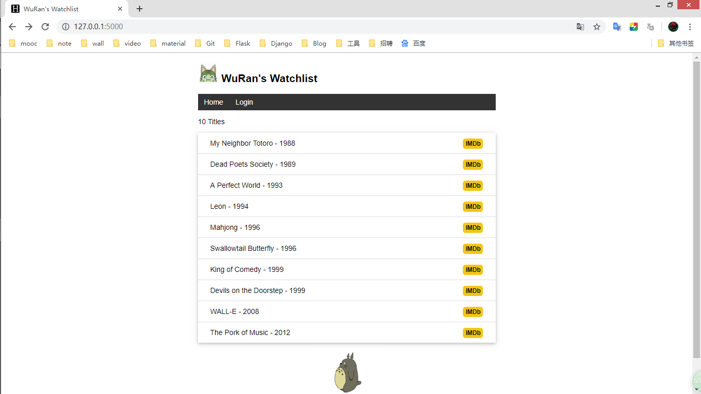

# Watchlist

http://docs.jinkan.org/docs/flask/



## Installation

```
$ git clone https://github.com/greyli/watchlist.git
$ cd watchlist
$ pipenv install --dev
$ pipenv shell
$ flask forge
$ flask run
* Running on http://127.0.0.1:5000/
```

## License

This project is licensed under the MIT License (see the
[LICENSE](LICENSE) file for details).
